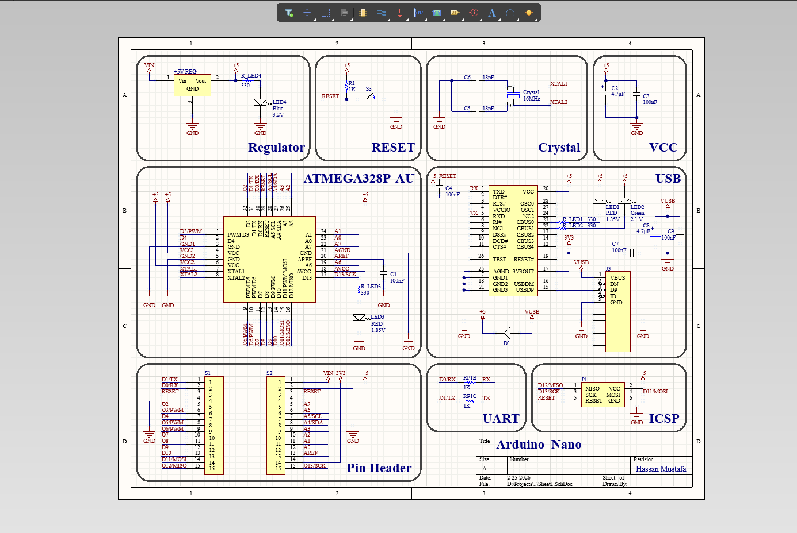
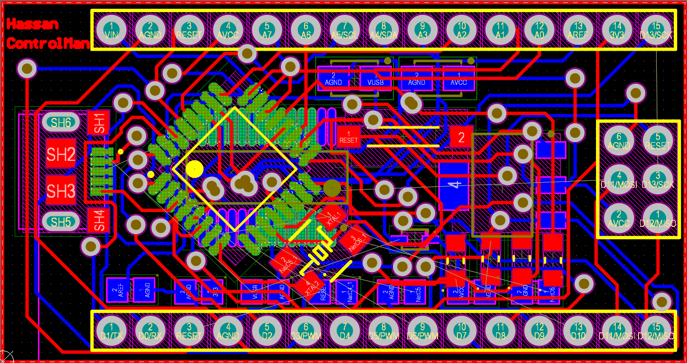
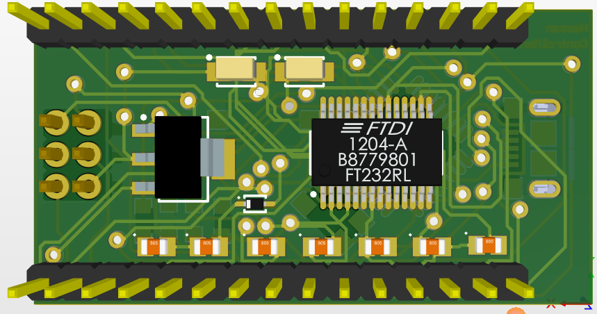
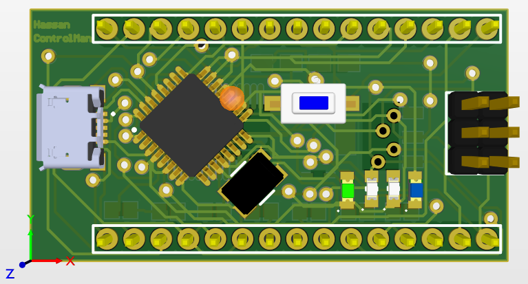

# Arduino Nano Development Board 🚀

Welcome to the repository for the **Arduino Nano Development Board**, a custom-designed, compact AVR microcontroller board compatible with the Arduino ecosystem.

👤 **Designed by:** Hassan Mustafa Hashem | Industrial Electronics & Control Engineering.

---

## 📖 Project Overview
This project is a complete hardware design (Schematic & PCB) of an ATmega328P-based development board. It is engineered to facilitate rapid prototyping for industrial control, automation, and embedded systems applications. 

🌐 **[Click Here to View the Interactive 3D Board & Project Website](https://hassan-ibn-mustafa.github.io/Arduino_Nano/)**

---

## ✨ Key Features & Hardware Specs
* **Microcontroller:** Microchip ATmega328P-AU (TQFP-32 SMD package).
* **Clock Speed:** 16MHz crystal oscillator for precise timing operations.
* **Power Management:** On-board 5V linear voltage regulator supporting dual power inputs (USB & VIN).
* **I/O Connectivity:** Standard 2.54mm pitch headers for all GPIOs, UART, and a dedicated ICSP header for bootloader flashing.
* **PCB Specs:** 2-Layer compact design with optimized VCC/GND routing and decoupling capacitors for signal integrity.

---

## 📂 Repository Structure
To keep the project organized and professional, the files are structured as follows:

* 📁 **`Hardware/`**: Contains the native Altium Designer source files (`.PrjPcb`, `.SchDoc`, `.PcbDoc`).
* 📁 **`Fabrication_Files/`**: Contains the exported PDF schematics and the Bill of Materials (BOM).
* 📁 **`Images/`**: High-resolution 2D and 3D renders of the PCB for quick viewing.
* 📄 **`index.html`**: The source code for the interactive portfolio website.

---

## 📸 Previews

### Schematic Layout

---

### 2D PCB View

---

### 3D PCB View

---

## 🛠️ Software Used
* **Altium Designer** (Schematic Capture & PCB Layout)
